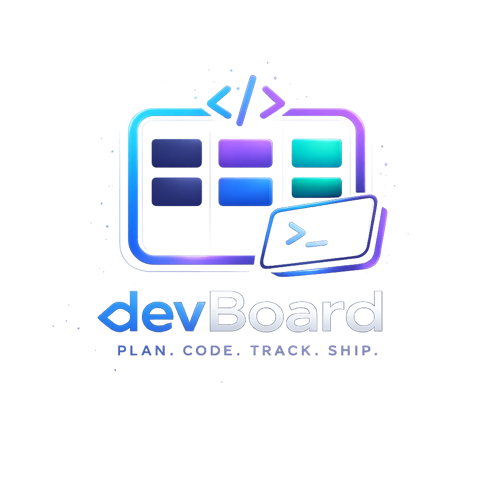

<p align="center">
  
</p>

<h1 align="center">devBoard</h1>

<p align="center">
  <strong>Developer-Centric Project Management Platform</strong>
</p>

<p align="center">
  Plan. Code. Track. Ship.
</p>

<p align="center">
  A modern developer operating system for managing projects, sprints, technical notes, and engineering workflows.
</p>

---

<p align="center">
  
  
  
  
</p>

---

## Overview

devBoard is a modern full-stack productivity platform designed specifically for developers managing multiple software projects simultaneously.

Unlike traditional project management platforms focused on enterprise business workflows, devBoard is optimized for:
- technical task management
- sprint execution
- code snippet organization
- architecture planning
- developer notes
- engineering-focused workflows

The platform combines Kanban workflows, Markdown-powered documentation, syntax-highlighted code snippets, and sprint planning into one unified workspace.

[](https://react.dev)
[](https://nodejs.org)
[](https://mongodb.com)
[](https://tailwindcss.com)
[](https://vitejs.dev)
[](https://jwt.io)

<br />

[Live Demo](#) · [Report Bug](../../issues) · [Request Feature](../../issues)

<br />

</div>

---

## What is devBoard?

devBoard is a **developer-first personal project management platform** designed specifically for software engineers who juggle multiple projects at once.

Most project management tools are built for product managers and business teams. devBoard is different — it speaks your language. Instead of story points and business workflows, it gives you **algorithmic complexity tags**, **syntax-highlighted code snippets inside tasks**, **Markdown-powered notes**, and a **Kanban board that feels native to your development flow**.

Think of it as a lightweight operating system for your solo engineering work — everything you need to plan, build, and ship — without the noise.

---

## Why devBoard instead of Jira / Trello / Notion?

| Feature | Jira | Trello | Notion | **devBoard** |
|---|---|---|---|---|
| Built for developers | ⚠️ Partial | ❌ No | ⚠️ Partial | ✅ Yes |
| Code snippets in tasks | ❌ No | ❌ No | ⚠️ Limited | ✅ Syntax Highlighted |
| Algorithmic complexity tags | ❌ No | ❌ No | ❌ No | ✅ O(1) → O(n²) |
| Markdown task descriptions | ❌ No | ❌ No | ✅ Yes | ✅ Yes |
| Dark mode first | ❌ No | ❌ No | ⚠️ Optional | ✅ Always |
| Drag-and-drop Kanban | ⚠️ Heavy | ✅ Yes | ❌ No | ✅ Smooth & Fast |
| Sprint planning | ✅ Complex | ❌ No | ❌ No | ✅ Lightweight |
| Technical notes per project | ❌ No | ❌ No | ✅ Yes | ✅ Yes |
| Solo developer focused | ❌ Enterprise | ❌ Team | ❌ General | ✅ Solo dev first |
| Setup complexity | 🔴 High | 🟡 Medium | 🟡 Medium | 🟢 Minimal |

> devBoard is not trying to replace enterprise tools. It's the tool those tools forgot to build — for the developer working alone, shipping fast, thinking in code.

---

## Core Features

### 🗂️ Multi-Project Dashboard
Manage all your projects from a single clean dashboard. Each project card shows tech stack, completion status, active sprint, and pending task count at a glance.

### 🎯 Kanban Board with Drag & Drop
A fluid, animated Kanban board with four developer-focused columns — **Backlog**, **In Progress**, **Code Review**, and **Done**. Built with `dnd-kit` for smooth, accessible drag interactions.

### 🧠 Algorithmic Complexity Tagging
Forget story points. Tag your tasks with actual algorithmic complexity — `O(1)`, `O(log n)`, `O(n)`, `O(n log n)`, `O(n²)` — to indicate implementation difficulty the way engineers think about it.

### 💻 Syntax-Highlighted Code in Tasks
Embed code snippets directly inside task descriptions with full syntax highlighting across JavaScript, TypeScript, Python, Java, C++, and more. No more copy-pasting into separate notes.

### 📝 Markdown Task Descriptions
Write rich task descriptions using full Markdown — headings, lists, inline code, tables, and links. Rendered beautifully inside every task card.

### ⚡ Sprint Planning
Create lightweight sprints with a name, goal, start/end dates, and assign tasks to them. Filter your Kanban by active sprint. No bloated ceremony — just enough structure to stay focused.

### 📓 Technical Notes Workspace
Each project has its own dedicated notes section for architecture planning, debugging logs, API references, and implementation ideas. Markdown and code blocks supported, with auto-save.

### 🔒 JWT Authentication
Secure registration and login with JWT-based stateless auth, bcrypt password hashing, and protected routes throughout.

### 📎 File Attachments
Upload screenshots, wireframes, PDFs, and diagrams directly to tasks. Architecture is S3-ready for production deployment.

---

## Screenshots

<details>
<summary>Click to view UI Screenshots</summary>

  ### Authentication


</br>

### Project Dashboard


### Add Project


### Project dashboard


### Kanban Board & Tasks


### Add task


### Manage Task using Drag and Drop


### Markdown Notes


### Create Sprint


### Project Dashboard


## Tech Stack

### Frontend
- **React 18** + **Vite** — Fast dev experience and optimized builds
- **Tailwind CSS** — Utility-first dark-mode-first styling
- **dnd-kit** — Accessible, performant drag and drop
- **react-markdown** — Markdown rendering in tasks and notes
- **react-syntax-highlighter** — Code blocks with language-specific highlighting
- **react-router-dom** — Client-side routing with protected routes
- **axios** — HTTP client with request/response interceptors
- **lucide-react** — Clean developer-oriented icon set

### Backend
- **Node.js** + **Express.js** — REST API server
- **MongoDB** + **Mongoose** — Flexible document database
- **JWT** + **bcryptjs** — Stateless auth with secure password hashing
- **multer** — File upload handling
- **dotenv** + **cors** — Config and cross-origin support

---

## Project Structure

```
devBoard/
│
├── client/                          # React Frontend
│   ├── public/
│   └── src/
│       ├── components/              # Reusable UI components
│       │   ├── kanban/              # Kanban board, columns, task cards
│       │   ├── projects/            # Project cards, create modal
│       │   └── ui/                  # Shared: spinner, empty state, badges
│       ├── pages/                   # Route-level page components
│       ├── layouts/                 # AuthLayout, DashboardLayout
│       ├── context/                 # AuthContext (global auth state)
│       ├── hooks/                   # useProjects, useTasks custom hooks
│       ├── services/                # Axios API service layer
│       ├── utils/                   # Helper functions
│       └── routes/                  # ProtectedRoute, PublicRoute
│
└── server/                          # Node.js Backend
    ├── config/                      # DB connection, constants
    ├── controllers/                 # Route handler logic
    ├── middleware/                  # JWT auth middleware
    ├── models/                      # Mongoose schemas
    ├── routes/                      # Express route definitions
    ├── utils/                       # Response handlers, helpers
    └── uploads/                     # Local file storage (MVP)
```

---

## Getting Started

### Prerequisites

- Node.js `v18+`
- MongoDB (local or Atlas)
- npm `v9+`

### 1. Clone the repository

```bash
git clone https://github.com/yourusername/devboard.git
cd devboard
```

### 2. Setup the Backend

```bash
cd server
npm install
```

Create a `.env` file inside `server/`:

```env
PORT=5000
MONGO_URI=mongodb://localhost:27017/devboard
JWT_SECRET=your_super_secret_key_here
CLIENT_URL=http://localhost:5173
```

Start the backend:

```bash
npm run dev
```

### 3. Setup the Frontend

```bash
cd client
npm install
```

Create a `.env` file inside `client/`:

```env
VITE_API_URL=http://localhost:5000/api
```

Start the frontend:

```bash
npm run dev
```

### 4. Open in browser

```
http://localhost:5173
```

Register an account and start building. 🚀

---

## API Overview

| Method | Endpoint | Description |
|---|---|---|
| `POST` | `/api/auth/register` | Register new user |
| `POST` | `/api/auth/login` | Login and get token |
| `GET` | `/api/auth/me` | Get current user |
| `GET` | `/api/projects` | Get all projects |
| `POST` | `/api/projects` | Create project |
| `PUT` | `/api/projects/:id` | Update project |
| `DELETE` | `/api/projects/:id` | Delete project + all data |
| `GET` | `/api/tasks/:projectId` | Get tasks for project |
| `POST` | `/api/tasks/:projectId` | Create task |
| `PUT` | `/api/tasks/:id` | Update task |
| `PATCH` | `/api/tasks/reorder` | Bulk reorder tasks |
| `DELETE` | `/api/tasks/:id` | Delete task |
| `GET` | `/api/sprints/:projectId` | Get sprints |
| `POST` | `/api/sprints/:projectId` | Create sprint |
| `GET` | `/api/notes/:projectId` | Get notes |
| `POST` | `/api/notes/:projectId` | Create note |
| `POST` | `/api/upload` | Upload file attachment |
| `GET` | `/api/health` | Health check |

---

## Roadmap

- [x] JWT Authentication
- [x] Project Dashboard
- [x] Kanban Board with Drag & Drop
- [x] Task Cards with Markdown + Syntax Highlighting
- [x] Algorithmic Complexity Tagging
- [x] Sprint Planning
- [x] Technical Notes Workspace
- [x] File Attachments
- [ ] GitHub OAuth
- [ ] Real-time collaboration (WebSockets)
- [ ] AI task suggestions
- [ ] Export project to PDF/Markdown
- [ ] GitHub Issues sync
- [ ] Dark / Light theme toggle
- [ ] Analytics dashboard

---

## Design Philosophy

devBoard is designed around three principles:

**1. Developer Context First**
Every feature is designed around how developers actually think — not how project managers want to track developers. Complexity tags, code snippets, and Markdown aren't add-ons — they're first-class citizens.

**2. Low Friction, High Signal**
No mandatory fields. No complex workflows. No onboarding wizards. Open the app, create a project, start moving tasks. The interface gets out of your way.

**3. Polished but Not Precious**
devBoard looks good because good tools should look good. Dark mode isn't a setting — it's the default. The UI is inspired by Linear, Vercel, and GitHub — tools developers already love.

---

## Contributing

Contributions are welcome! If you find a bug or have a feature idea:

1. Fork the repository
2. Create your branch: `git checkout -b feature/your-feature`
3. Commit your changes: `git commit -m 'Add your feature'`
4. Push to the branch: `git push origin feature/your-feature`
5. Open a Pull Request

---

## License

Distributed under the MIT License. See `LICENSE` for more information.

---

## Built For

- Solo developers
- Indie hackers
- Students building projects
- Developers managing multiple repositories
- Engineers who prefer technical workflows over business-heavy tooling
